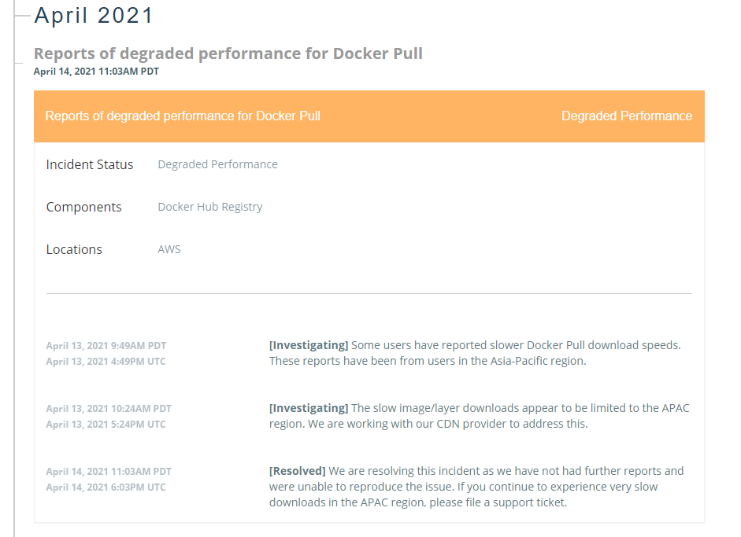

<h1>Lesson Learnt</h1>

After a night of complaining to myself about the poor performance of `Docker pull` on a VPS I have hosted in Asia, I just stumbled onto the 

[https://status.docker.com/](https://status.docker.com/https://status.docker.com/pages/history/533c6539221ae15e3f000031) website. 

<figure class="figure text-center col-xs-12 col-sm-12 col-lg-12">
  
  <figcaption class="figure-caption text-center fw-normal text-dark">Current system status of Docker where you can view active incidents or upcoming maintenances.</figcaption>
</figure>