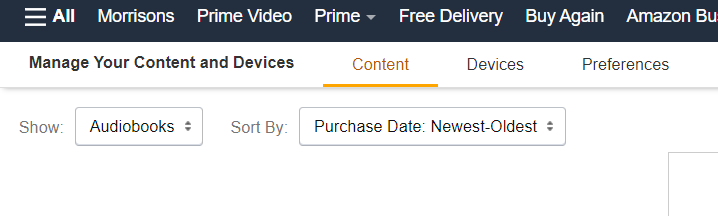
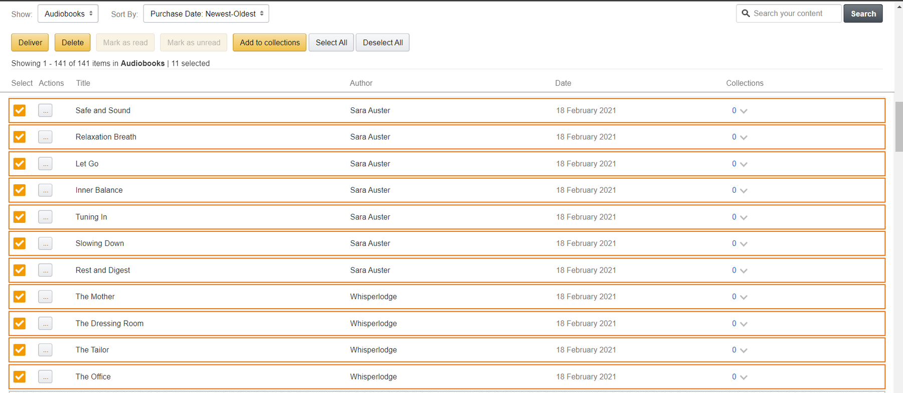

The weekend just gone I decided to have a digital de-clutter. While I could (and might) write an article on tips and tricks to remove digital clutter; this is not what this post is about. During the de-clutter I decided to prune my iPhone, removing images from camera roll and archiving the keepsakes to the cloud, deleting notes or moving them to my Notion app for archiving where appropriate, and deleting unused phone apps. 

While in my flow I decided to organise my Audible, this is where my flow halted... 

I love Audible! A while back I made listening to audio books part of my daily routine and at the time of this post I currently have 208 books downloaded to my device. In the effort to organise and reduce the digital clutter I mentioned I decided to go through and organise my book library and my podcasts into collections for easy retrieval. All was going well until I got to an Amazon Original podcast that I just didn't want on my device anymore. I downloaded it with the intention or listening to all the episodes but couldn't make it through the first one and so I decided the best remediation would be to delete it. Easy right?

I am only a partially educated man who went to university twice and has completed some of the top networking, system administration and pentesting certificates in the industry and deleting an audiobook should be a piece of cake right!? Navigating around a a GUI should be no problem for a person that has to periodically test web applications for his living.... Nope. 

It seems, the Amazon original podcasts are just not the same as regular books. In fact,  you cannot remove them from the iPhone application.  So I headed over to the audible.co.uk website to one again try and delete. After 15 minutes of refusing to Google and navigating around all of the menus in both the phone app and the audible.co.uk desktop website I felt defeated. 

As part of my living I hack websites and so admitting defeat against a web UI is simply just not an option but thats what it came too.... I put it down as a bug and took to google to see if anyone else had the same problem. Turns out that many people have problems deleting normal books (which are easy to remove from your device) and if anyone out there did have the answer it was buried. 

This takes me up to today! I still get a Free Subscription to the Amazon AWS Newsletter send to my kindle app and I wanted to remove it along with some sample books. This is where I discovered the answer to my previous problem. 

You see, audible originals, are a lot more like podcasts than they are audiobooks and as I mentioned, there's no way to move them from the iPhone or Android, application or even on the audible website. However, there is a way around this.

To do this, you actually have to 

1, Login to the Amazon website.
2, Go to Accounts, the drop down menu will appear.
3, Look towards the end of the list, you'll see an option say manage your content and devices.

<figure class="figure text-center col-xs-12 col-sm-12 col-lg-12"><figcaption class="figure-caption text-center fw-normal text-dark">Account Menu on Amazon.</figcaption></figure>

4, Once you're there, you need to select Show order books from the drop down menu.

<figure class="figure text-center col-xs-12 col-sm-12 col-lg-12"><figcaption class="figure-caption text-center fw-normal text-dark">Manage Your Content and Devices</figcaption></figure>

Once you do this you might notice that you have a lot more items appearing than what you can see in the audible library. This is because each episode, within the series is listed as a separate item.

Now, the search and the ordering and filtering on this screen, are not great, but it's enough to get you what you need, and that is to find the titles that you don't want anymore.

5, Using the checkbox on the left hand side, select them. An orange border or circle on the rows on the table.

<figure class="figure text-center col-xs-12 col-sm-12 col-lg-12"><figcaption class="figure-caption text-center fw-normal text-dark">Select Items to Delete</figcaption></figure>

6, Go up to the top, delete button marked in orange and click Delete. A pop up will come, explaining that these items have been removed from your library.
7, Now it is time to go to your app and sync your library.

> You can do this by holding and pulling down on the home screen, until you see the little loader symbol starts to spin, alternatively, you can just double tap on the home key, and close the application completely, once the app is opened it will also have the same effect.